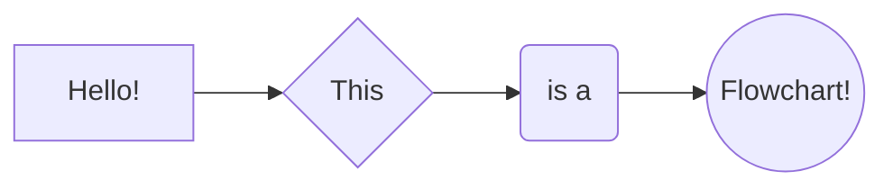

# 基本标记语法

GitHub使用 [kramdown](https://kramdown.gettalong.org/syntax.html) 作为GitHub风格的标记（GitHub Flavored Markdown (GFM)）。下面列出了一些语法。

## 排版

```md
*这是斜体.* **这是粗体**. * 如果星号被空格包围，则不会解析星号。 *

_这也是斜体_ __这也是粗体__. _ 如果下划线被空格包围，则不会解析下划线 _

[这是一个外部链接](https://bit.ly). `"https://"` 这很重要。 [这是一个内部链接](#typesetting). 内部链接都是小写，空格替换为连字符"-"。

你可以像这样混合他们 [*this*](https://bit.ly), [`this`](https://bit.ly), **[this](https://bit.ly)**, 但不是 `[this](https://bit.ly)`.

==GFM 不支持高亮显示，但我在此主题上实现了高亮显示。==

```

*这是斜体.* **这是粗体**. * 如果星号被空格包围，则不会解析星号。 *

_这也是斜体_ __这也是粗体__. _ 如果下划线被空格包围，则不会解析下划线 _

[这是一个外部链接](https://bit.ly). `"https://"` 这很重要。 [这是一个内部链接](#typesetting). 内部链接都是小写，空格替换为连字符"-"。

你可以像这样混合他们 [*this*](https://bit.ly), [`this`](https://bit.ly), **[this](https://bit.ly)**, 但不是 `[this](https://bit.ly)`.

==GFM 不支持高亮显示，但我在此主题上实现了高亮显示。==

## 列表

```markdown
- 这是无序列表
  - 子项
    - 子子项
      - 子子子项
        - 它可以一直这样下去
- 列表可以有多行

  就像这个，
- > 或引号
- ```markdown
  或使用代码
​```

---

1. 这是有序列表
   1. 子项
2. 这也是
3. 它可以一直这样下去

---

1. 您可以避免像这样编号
   1. 子项
1. 它将一直这样下去
1. 歪比巴布
```

- 这是无序列表
  - 子项
    - 子子项
      - 子子子项
        - 它可以一直这样下去
- 列表可以有多行

  就像这个，
- > 或引号
- ```markdown
  或使用代码
​```

---

1. 这是有序列表
   1. 子项
2. 这也是
3. 它可以一直这样下去

---

1. 您可以避免像这样编号
   1. 子项
1. 它将一直这样下去
1. 歪比巴布

## 图片

```markdown
Markdown uses `` to reference pictures, caption is optional. You cannot control the size. 


So I prefer using HTML tags like this:


```

Markdown uses `` to reference pictures, caption is optional. You cannot control the size. 


So I prefer using HTML tags like this:


> Note: I consulted GitHub support about using `raw.github` link for pictures, they said it's okay to do so:
>
> > **Can I use raw links to show my pictures in my blog?**
> >
> > I know this is not how the Jekyll recommended. Still I am wondering if this practice is discouraged from you guy for if my site got more popular and the traffic would be greater. I would like to know is there any traffic limit on the raw links and is there any work arounds that I could keep my directory structure?
>
> and they said:
>
> > Hi Yingkai,
> >
> > Thanks for reaching out.
> >
> > We don't endorse this kind of structure typically, but it doesn't seem to be causing any problems on our end.
> >
> > Also, there isn't any documented traffic limit on raw links nor are we aware of any workarounds (though it's possible they exist).
> >
> > We'll be sure to reach out if the traffic is causing undue load on our systems, but we're open to answering any other questions you may have about this. Cheers!
> >
> > All the best,
> > GitHub Staff

## Blocks: Blockquotes, Code fences

```markdown
> This is a quote block
>
> > This is a quote block in side another

​```python
# This is a python code fence
import numpy as np
print("""This is a python code fence""")
​```

​```fortran
! This is a fortran code fence
implicit none
​```

​```
This is a simple code fence. You can use it to display text in Mono fonts.
​```

You can mix them as well, like 

>```
>this.
>```
```

> This is a quote block
>
> > This is a quote block in side another

```python
# This is a python code fence
import numpy as np
print("""This is a python code fence""")
```

```fortran
! This is a fortran code fence
implicit none
```

```
This is a simple code fence. You can use it to display text in Mono fonts.
```

You can mix them as well, like 

>```
>this.
>```

## Tables

```markdown
| This column is left aligned | This column is centered | This column is right aligned |
| :-------------------------- | :---------------------: | ---------------------------: |
| 1                           |            4            |                            7 |
| 2                           |            5            |                            8 |
| 3                           |            6            |                            9 |

| You can use `` in tables.                    | You can use Math in tables. | You can use `` in tables.               |
| ------------------------------------------------------------ | --------------------------- | ------------------------------------------------------------ |
|  | $1+1=2$                     |  |
```

| This column is left aligned | This column is centered | This column is right aligned |
| :-------------------------- | :---------------------: | ---------------------------: |
| 1                           |            4            |                            7 |
| 2                           |            5            |                            8 |
| 3                           |            6            |                            9 |

| You can use `` in tables.                    | You can use Math in tables. | You can use `` in tables.               |
| ------------------------------------------------------------ | --------------------------- | ------------------------------------------------------------ |
|  | $1+1=2$                     |  |

## Mathjax

```markdown
This is inline math $\sum_{i=1}^{N} i $. This is display math.

$$
\sum_{i=1}^{N} i 
$$

[Mathjax](http://docs.mathjax.org/en/latest/tex.html) syntax is like latex. You cannot use `\usepackge`, but you can use `\newcommand` like this 

$$
\newcommand{\NewOp}[2]{\lbrace{#1}\mid \otimes{#2}\rbrace}
$$

And `\NewOp` will be available in all later math blocks, whether inline $\NewOp{x}{y}$ or display

$$
\NewOp{x}{y}
$$

Be **very careful** with the vertical bar symbol and underscore in math. If you use it like $|x|\ge 0$, $|0|=0$, or like $\lbrace x | x\gt 0\rbrace$, you will get a bunch of gibberish.

Use `\vert` in $\vert x\vert\ge 0$, $\vert 0\vert=0$. Use `\mid` in $\lbrace x \mid x\gt 0​$ instead.

Also using underscores like this $x_1$, $x_2$, $x_{c_2}^{c_3}$, with $y_{c_2}^{c_3}​$, will be processed as _this_.

Wrap underscores with whitespaces like this $x _ 1$, $x _ 2$, $x _ {c _ 2}^{c _ 3}$, with $y _ {c _ 2}^{c _ 3 }​$.
```

This is inline math $\sum_{i=1}^{N} i $. This is display math.

$$
\sum_{i=1}^{N} i 
$$

The extra empty line matters, or you will end up with
$$
\sum_{i=1}^{N} i
$$

[Mathjax](http://docs.mathjax.org/en/latest/tex.html) syntax is like latex. You cannot use `\usepackge`, but you can use `\newcommand` like this 

$$
\newcommand{\NewOp}[2]{\lbrace{#1}\mid \otimes{#2}\rbrace}
$$

And `\NewOp` will be available in all later math blocks, whether inline $\NewOp{x}{y}​$ or display

$$
\NewOp{x}{y}
$$


## Mermaid diagram

 Not supported by GFM, implemented using JavaScript.

```
​```mermaid
  graph LR;
    
  A[Hello!] --> B{This}
  B --> C(is a)
  C --> D((Flowchart!))
​```
```



## Headings

```
# Heading 1

## Heading 2

### Heading 3

#### Heading 4

##### Heading 5

###### Heading 6
```

# Heading 1

## Heading 2

### Heading 3

#### Heading 4

##### Heading 5

###### Heading 6

# Kind Reminders for Bloggers

## Mathjax Pitfalls

1. 

   do not use `{{` anywhere in your math. Say `\bra{{-2}^\psi}` use `{ {` instead. Jekyll will parse that as liquid tags. You can do that by replacing. 

   

2. do not use `x_1` in inline math, write that as `x _ 1`. Jekyll will parse that as italic fonts. You can do that by replacing, but be careful that some of the links contains `_` so make sure you correct those links afterwards.

```
   Using underscores like this $x_1$, $x_2$, $x_{c_2}^{c_3}$, with $y_{c_2}^{c_3}$, will be processed as _italic_.

   Wrap underscores with whitespaces like this $x _ 1$, $x _ 2$, $x _ {c _ 2}^{c _ 3}$, with $y _ {c _ 2}^{c _ 3 }$.
```

   Using underscores like this $x_1$, $x_2$, $x_{c_2}^{c_3}$, with $y_{c_2}^{c_3}$, will be processed as _italic_.

   Wrap underscores with whitespaces like this $x _ 1$, $x _ 2$, $x _ {c _ 2}^{c _ 3}$, with $y _ {c _ 2}^{c _ 3 }​$.

3. ```
   Be **very careful** with the vertical bar symbol and underscore in math. If you use it like $|x|\ge 0$, $|0|=0$, or like $\lbrace x | x\gt 0\rbrace$, you will get a bunch of gibberish.
   
   Use `\vert` in $\vert x\vert\ge 0$, $\vert 0\vert=0$. Use `\mid` in $\lbrace x \mid x\gt 0​$ instead.
   ```

   Be **very careful** with the vertical bar symbol and underscore in math. If you use it like $|x|\ge 0$, $|0|=0$, or like $\lbrace x | x\gt 0\rbrace​$, you will get a bunch of gibberish.

   Use `\vert` in $\vert x\vert\ge 0$, $\vert 0\vert=0$. Use `\mid` in $\lbrace x \mid x\gt 0\rbrace$ instead.

4. Use `\newline` instead of `\\` in inline math. `\substack` is a very useful command.

5. ```markdown
   The extra empty line of displaymath matters, or you will end up with
   $$
   \sum_{i=1}^{N} i
   $$
   ```

   The extra empty line matters, or you will end up with
   $$
   \sum_{i=1}^{N} i
   $$

## YAML front matter pitfalls

Don't use `[ ]` in YAML front matter. 

Don't use `:` in YAML front matter. If you have to, use pipe line:

```
title: >
   The Matrix II: Reload
```

## Typora related

`` will be rendered by typora but Jekyll only renders ``


## Foot Notes

This is a note[^1]. Footnotes can have captions like[^this]. You can reference to the same note multiple times like[^this]. Foot notes can have many other options like[^this-one]. Or just like [^that]. This is a [reference style link][linkid] to a page. And [this][linkid] is also a link. As is [this][] and [that].

# Foot Notes

The Foot notes are like this


[^1]: https://yk-liu.github.io
[^this]: https://yk-liu.github.io

[^this-one]: 
    > Blockquotes can be in a footnote.

```
    as well as code blocks
```

[^that]: or, naturally, simple paragraphs.

[^linkid]: https://yk-liu.github.io "Optional Title"

